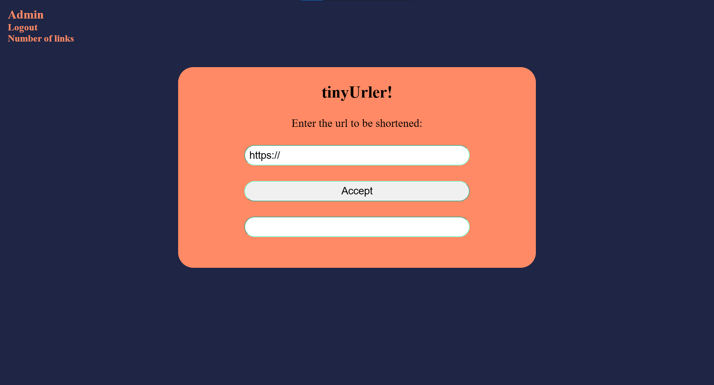

# TinyUrler

[](https://github.com/Ehsan-004/TinyUrler)
[](https://github.com/Ehsan-004/TinyUrler/blob/main/LICENSE)
[](https://github.com/Ehsan-004)

A simple URL shortener implemented with both Django and .NET frameworks.

## 📝 Description

TinyUrler is a URL shortening service that allows users to convert long URLs into shorter, more manageable links. This project is implemented using two different frameworks: Django (Python) and .NET (C#), providing versatility and options for developers. The .NET version includes an admin panel with login functionality, enhancing its usability and management capabilities.


## ⚙️ Installation

To set up TinyUrler, follow the installation instructions for your desired framework:

### Django Version

1.  **Clone the repository:**

    ```bash
    git clone https://github.com/Ehsan-004/TinyUrler
    cd TinyUrler/TinyURLer_DjangoVersion/TinyURLer
    ```

2.  **Create a virtual environment:**

    ```bash
    python -m venv venv
    source venv/bin/activate  # On Windows: venv\Scripts\activate
    ```

3.  **Install dependencies:**

    ```bash
    pip install -r requirements.txt
    ```
   
4.  **Apply migrations:**
    ```bash
    python manage.py migrate
    ```

5.  **Create a superuser for Django admin:**
    ```bash
    python manage.py createsuperuser
    ```

6.  **Run the development server:**

    ```bash
    python manage.py runserver
    ```
    The Django version will be accessible at `http://127.0.0.1:8000`

### .NET Version

1.  **Clone the repository:**

    ```bash
    git clone https://github.com/Ehsan-004/TinyUrler
    cd TinyUrler/TinyUrler_DotNetVersion
    ```

2.  **Install .NET SDK:**
    Make sure you have the .NET SDK installed on your machine. You can download it from [Microsoft's official website](https://dotnet.microsoft.com/download).
    
    See dependencies in `requirements.txt`.


3.  **Build the project:**

    ```bash
    dotnet build
    ```

4.  **Apply migrations:**
    ```bash
    dotnet ef database update
    ```

5.  **Run the application:**

    ```bash
    dotnet run
    ```

    The .NET version will be accessible at `https://localhost:7049` or `http://localhost:5205` or the port that is specified in the launchsettings.json file.

## 🖼️ Usage



### Accessing the Admin Panel

#### Django Version

1.  After running the Django server, navigate to `http://127.0.0.1:8000/admin/` in your browser.
2.  Log in using the superuser credentials you created during the installation.

#### .NET Version

1.  Uncomment line 51 to 76 in `program.cs` and run application to create an admin account
2.  After running the .NET application, navigate to `/admin/home/`
3.  Log in using specified credentials in `program.cs`.
4.  Don't forget to comment that part again.

## 🧑‍💻 Developer

- [Ehsan-004](https://github.com/Ehsan-004)

## 📜 License

This project is open-source and does not have a specific license. Feel free to use, modify, and distribute it as you see fit.